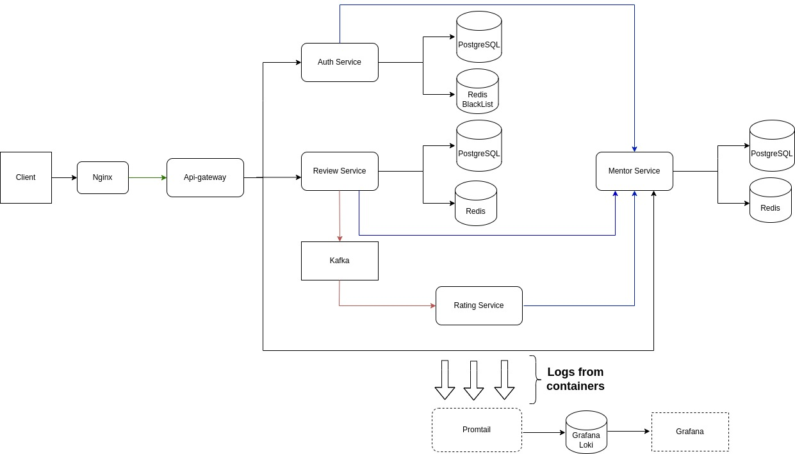

# MentorLink 🧠

Платформа для поиска менторов и публикации отзывов. Микросервисная архитектура с авторизацией, отзывами, рейтингом и централизованным логгированием.

---

## 🛠️ Технологии

- **Go** — основной язык
- **Kafka + Kafka UI** — шина событий
- **PostgreSQL + golang-migrate** — база и миграции
- **Redis** — быстрая память
- **Docker / Docker Compose** — всё в контейнерах
- **gRPC** — общение между сервисами
- **Promtail + Loki + Grafana** — логгирование без боли
- **nginx** — API Gateway

---

## 📐 Архитектура

> Схема текущей архитектуры проекта:



---

## ⚡ Быстрый старт

> Запускай всё одним махом — миграции, сервисы и логгирование.

```bash
# 1. Клонируем репу
git clone https://github.com/GkadyrG/MentorLink.git
cd MentorLink

# 2. Применяем миграции (внутри хоста)
make migrate-up-all

# 3. Запускаем всё, пересобирая образы
docker compose up -d --build
